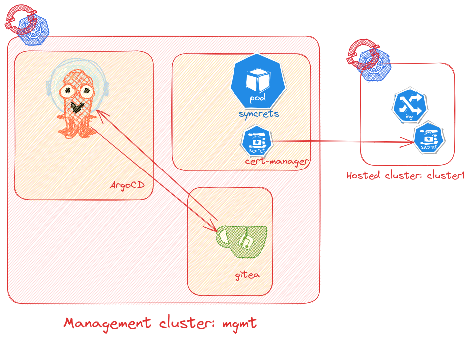

Prerequisites:

One of the main goal of this repository is to show how we can add certificates remotely. Certificates are generated locally on management cluster ${MGMT} in the `demo.sh` script and propgated through (syncrets)[] micro-controller. In order to avoid real certificates through an ACME we create a local issuer for `cert-manager`. The local issuer is based on (mini-ca)[./mini-ca].


This is optional but in case cluster pods cannot see each other you may want to chec connectivity.
```shell
$ export KUBECONFIG=$(mktemp)
$ ./00-boostrap-minikube-infra.sh
...
...
./192.168.50.161 cluster1
192.168.39.24 mgmt
192.168.39.24 my-git.io
```

Optionally you may want to check network connectivity between the clusters

```shell
$ ./01-check-minikube-infra-connectivity.sh
```

To run the the demo.

```shell
$ ./demo.sh
```


To cleanup all `minikube` clusters.

```shell
$ ./9-cleanup-minikube-infra.sh
```
